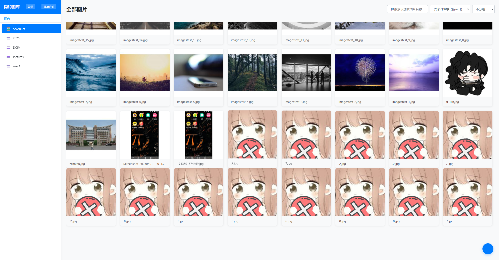
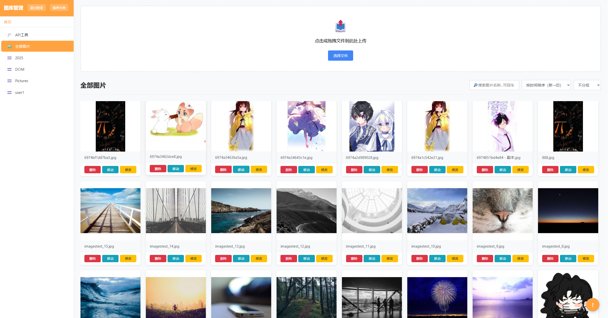
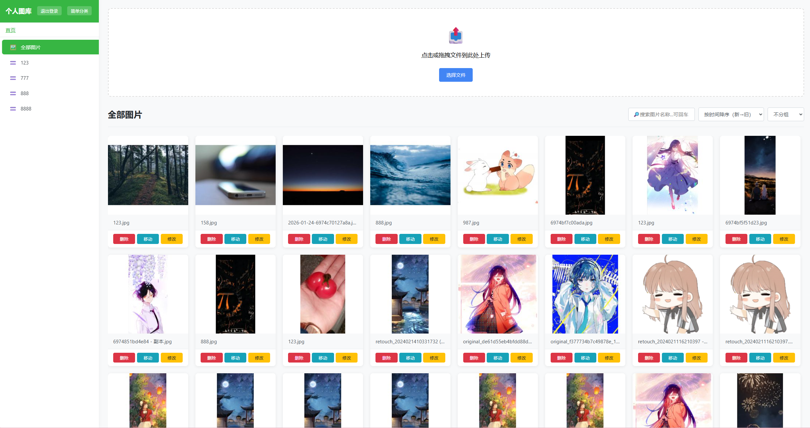
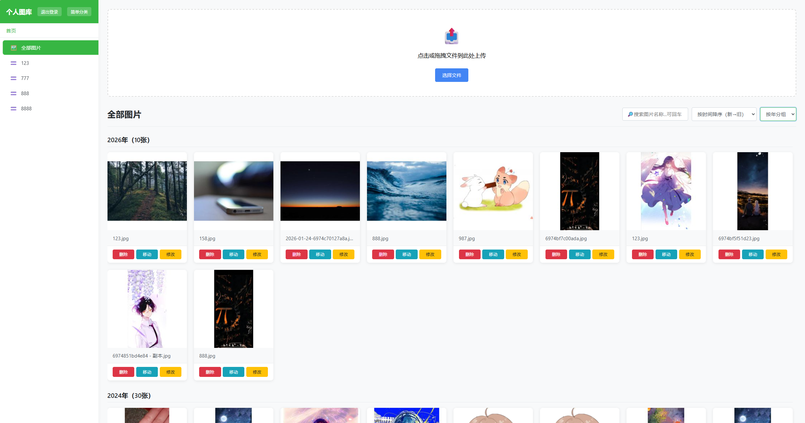
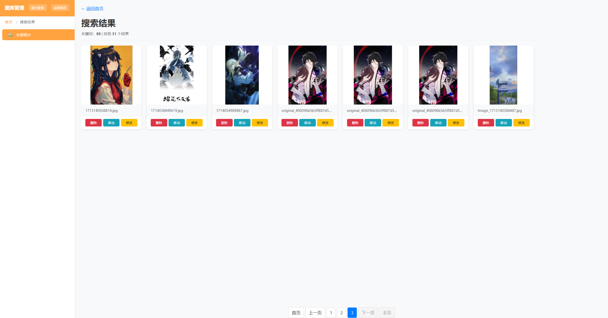
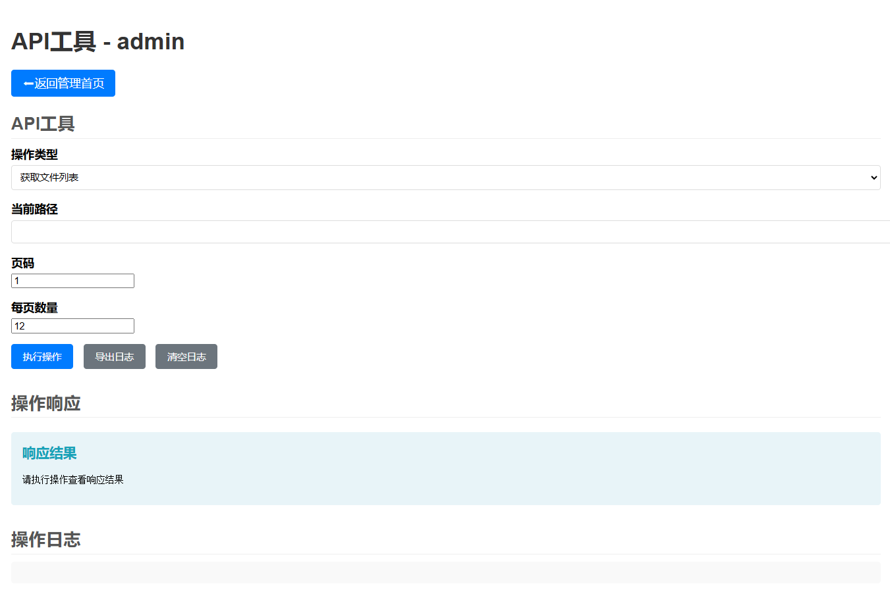

# 简约图库

## 开发环境：

Nginx 1.15.11

PHP 7.3.4

*   curl
*   fileinfo
*   gd2
*   mbstring
*   mysqli
*   openssl
*   pdo\_mysql
*   pdo\_sqlite

mysql 8.0

## 前端自动展示页面大致两页图片，与损坏图片处理。

## 登陆权限划分与不同权限下主体颜色

## 自动排分年月时间线

## 图片名搜索功能

## API使用工具

